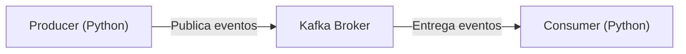

# Kafka Streaming Project (Python + Docker)

Projeto de **streaming de dados** utilizando **Docker + Kafka**, com **Producer** e **Consumer** implementados em Python e execução local via **:contentReference[oaicite:1]{index=1}**.

O objetivo é demonstrar o funcionamento básico de uma arquitetura orientada a eventos, simulando ingestão e consumo de dados em tempo real.

---

## Objetivo do Projeto

Simular um pipeline de streaming onde:
- um **Producer** gera eventos de pedidos,
- o **Kafka** atua como intermediário (broker),
- um **Consumer** fica continuamente escutando e processando os eventos.

Esse padrão é amplamente utilizado em sistemas de dados, mensageria, logs e processamento em tempo real.

---

## Arquitetura



- O producer publica mensagens em um tópico Kafka
- O Kafka gerencia e entrega as mensagens
- O consumer consome os eventos de forma assíncrona

---

## Tecnologias Utilizadas

- Apache Kafka  
- Docker & Docker Compose  
- Python 3  
- kafka-python

---

## Como Executar o Projeto

Este projeto roda localmente utilizando Docker para subir o Kafka e Python para executar o producer e o consumer.

### Pré-requisitos
- Docker e Docker Compose instalados
- Python 3 instalado

### Passo 1 — Subir o Kafka
No diretório do projeto, execute o comando abaixo para iniciar o Kafka e o Zookeeper:

```bash
docker compose up -d
```

### Passo 2 — Instalar as dependências Python

```bash
pip install -r requirements.txt
```

### Passo 3 — Executar o Consumer
Em um terminal, execute o consumer. Ele ficará em modo de espera aguardando mensagens do Kafka:

```bash
python consumer.py
```

### Passo 4 — Executar o Producer
Em outro terminal, execute o producer para enviar eventos para o Kafka:

```bash
python producer.py
```

Ao rodar o producer, as mensagens enviadas serão consumidas e exibidas em tempo real no terminal do consumer.
